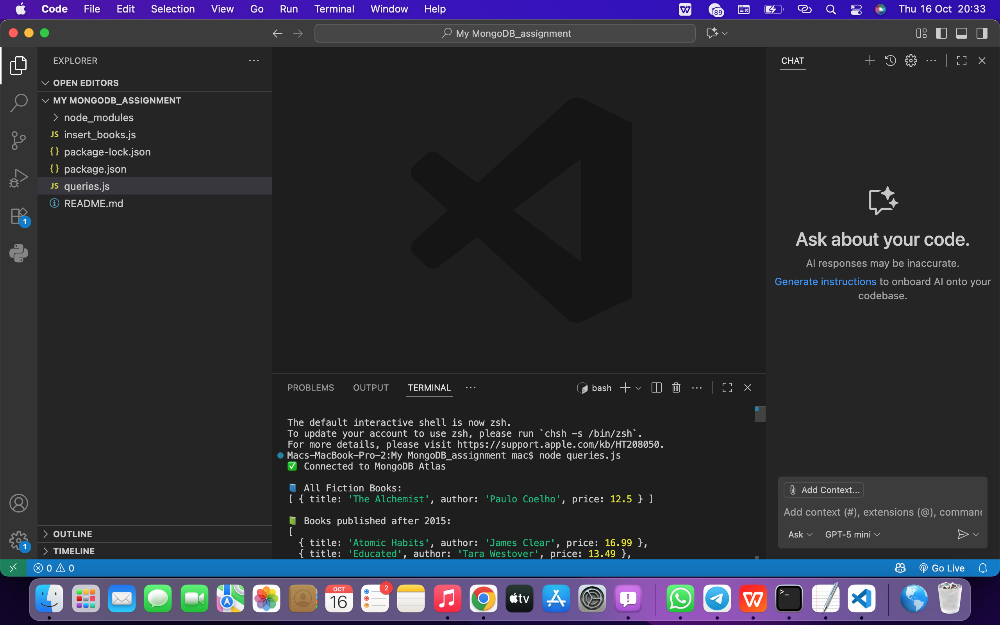
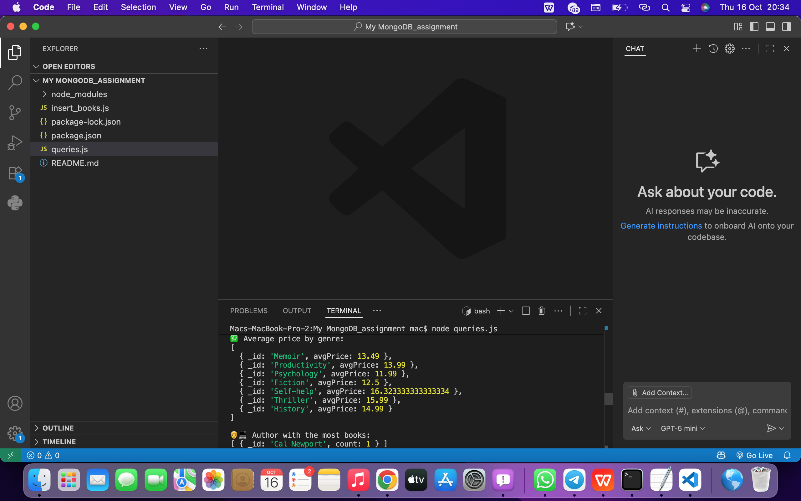
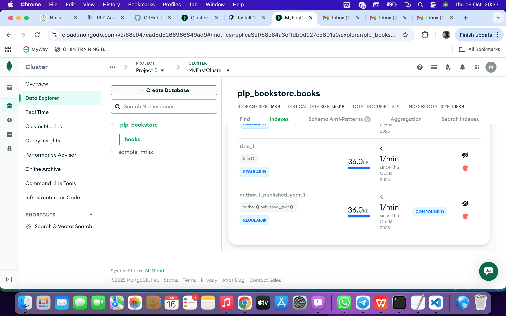
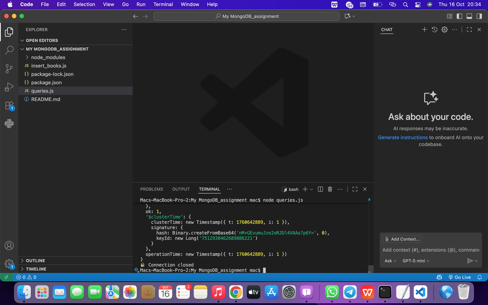
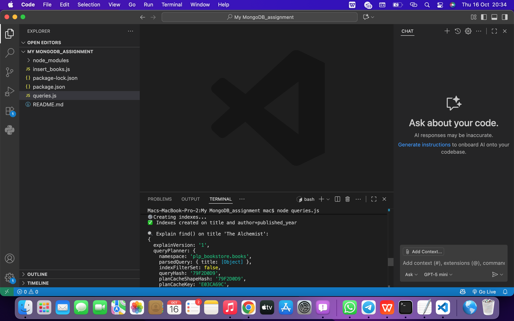
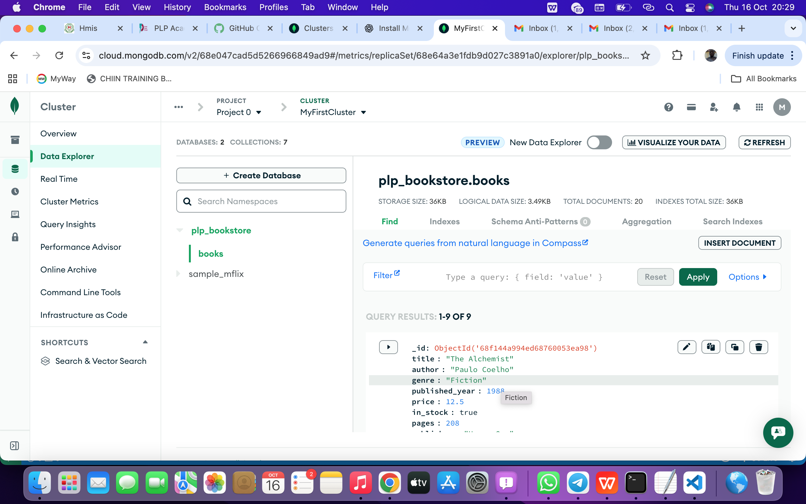
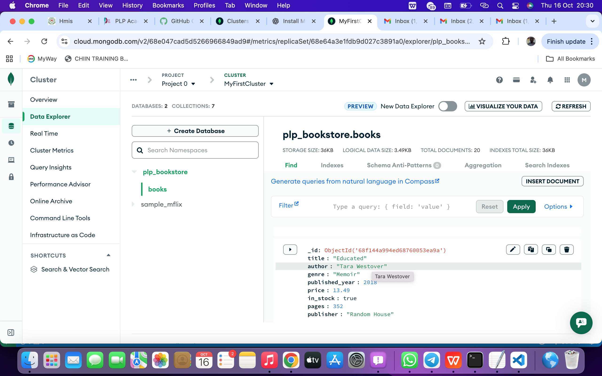
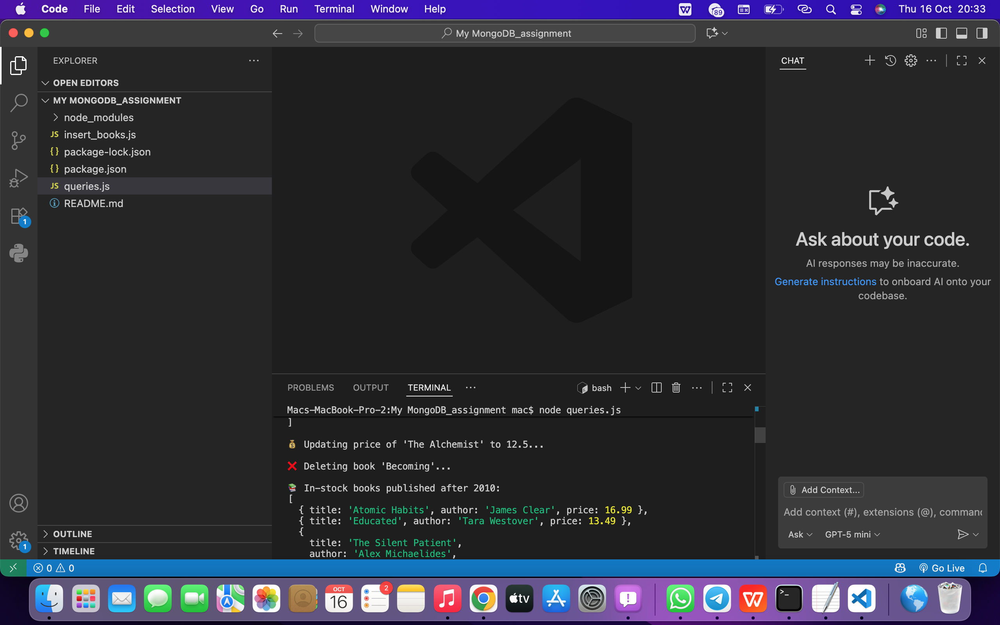
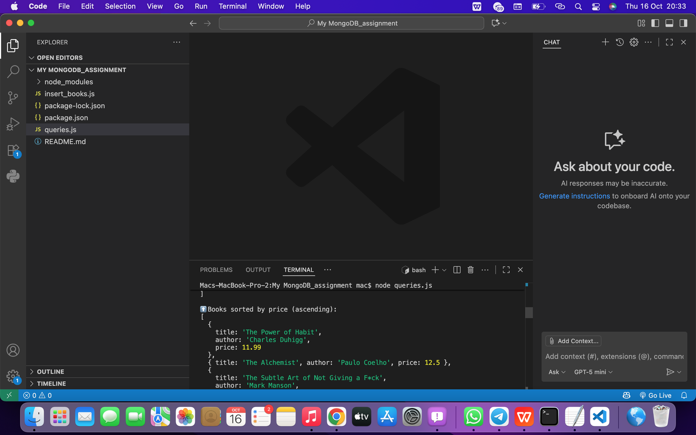

# MongoDB Assignment – Week 1

## Instructions to run scripts

1. Open terminal in the folder `MyMongoDB_Assignment`.
2. Install dependencies (if not already):

npm install

3. Run the script to insert books:

node insert_books.js

4. Run queries:

node queries.js

---

## MongoDB Assignment Screenshots

All Fiction Books  

Authors View  

Average Price  

Book Store View  

Cluster Time  

Indexes View  

MongoDB Cloud View  

PLP Book Store View  

Pagination View  

Updating Books in Stock  

Sorted by Price  

Screenshot Example  

